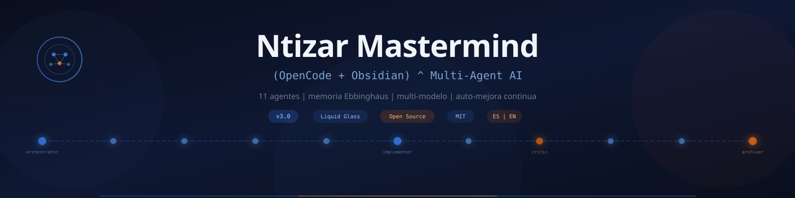

<p align="center">
  
</p>

<h1 align="center">Ntizar Mastermind</h1>

<p align="center">
  <strong>Personal AI agent system with semantic skill search,<br>persistent memory, and GitHub backup.</strong>
</p>

<p align="center">
  <a href="README.md">🇪🇸 Español</a> · <a href="tokens/">📊 Token Dashboard</a> · <a href="https://github.com/Ntizar/NtizarBrainMasterMind">GitHub</a>
</p>

<p align="center">
  
  
  
  
</p>

---

## What is Ntizar Mastermind?

**This is not an open-source framework.** It is a **personal AI agent system** — a very specific configuration of Hermes Agent + NaN.builders + ChromaDB + GitHub built for one person.

What it is: a **living reference architecture** showing how an AI agent can scale knowledge — 303 skills indexed semantically, continuous learning after every task, and everything persisted to GitHub.

---

## How It Works

```
User Task → Mastermind (agent on NaN.builders)
                │
                ├── 1. ChromaDB semantic search (qwen3-embedding)
                │     └── consultar-skills.py "keywords" --json
                │
                ├── 2. Filter relevant skills (score > 0.25)
                │     └── Load with skill_view() — no arbitrary limit
                │
                ├── 3. Execution level
                │     ├── 🟢 Direct    (1-3 tool calls)
                │     ├── 🟡 Simple   (4-8 tool calls)
                │     ├── 🟠 Parallel (delegate_task)
                │     └── 🔴 Complex  (multi-subagent orchestration)
                │
                └── 4. Continuous learning
                      ├── New skill?       → skill_manage(create)
                      ├── Session note?    → notes/YYYY-MM-DD-titulo.md
                      └── Durable fact?    → memory(add)
```

### 3 Knowledge Layers

| Layer | Location | Contents | Persistence |
|-------|----------|----------|-------------|
| 🧠 **Memory** | `/hermes-home/memories/` | Preferences, environment, lessons learned | Injected every turn |
| 📚 **Skills** | `/hermes-home/skills/` (303) | Reusable procedures, workflows, pitfalls | On-demand via ChromaDB |
| 🔒 **GitHub Repo** | `NtizarBrainMasterMind` | Full backup: skills, notes, scripts, config | Daily push 05:00 UTC |

### Semantic Search (ChromaDB)

Every `SKILL.md` is converted to a vector using `qwen3-embedding` (4096 dimensions) and indexed in ChromaDB. When a request arrives, the system searches by **meaning**, not by name:

```bash
cd /hermes-home/scripts
NAN_API="$NAN_API" /hermes-home/chromadb-venv/bin/python consultar-skills.py "public transit GTFS" --json
```

- **Collection:** `mastermind-skills` (localhost:8000)
- **Model:** qwen3-embedding via NaN API
- **Distance:** cosine | **Threshold:** > 0.25
- **Re-index:** Sunday 04:00 UTC (auto cron)
- **No skill limit:** if 50 are relevant → all 50 are loaded

---

## Tech Stack

| Component | Specification |
|-----------|---------------|
| **Model** | deepseek-v4-flash / qwen3.6 via NaN API |
| **Infra** | NaN.builders MicroVM (1vCPU / 2GB / 20GB) |
| **Agent** | Hermes Agent — max_turns: 90, delegation: 3 subagents |
| **Vector DB** | ChromaDB v2 — `mastermind-skills` collection, 4096d embeddings |
| **Embeddings** | qwen3-embedding (NaN API) — cosine distance |
| **GitHub** | `Ntizar/NtizarBrainMasterMind` — HTTPS token auth, no `gh` CLI |
| **TTS** | Edge TTS — voice `es-ES-AlvaroNeural` |
| **STT** | Whisper local (base model) |
| **Cron** | 8 active Hermes jobs |
| **Language** | **Spanish** — entire system: repos, scripts, cron, reports |

---

## Active Skills (303)

Indexed by ChromaDB and loaded on demand. Distribution by domain:

| Domain | Skills (approx) | Examples |
|--------|----------------|----------|
| 🔥 **Core (Software)** | ~25 | TDD, code review, debugging, refactor, system-audit |
| 📦 **GitHub** | ~7 | PR workflow, issues, repo management, auth |
| 🌐 **Frontend / CSS** | ~15 | Aurora DS, dashboards, liquid glass, design systems |
| ⚙️ **Backend / APIs** | ~15 | Node.js patterns, ESM, REST APIs, parallel fetch |
| 🏗️ **Infra / DevOps** | ~20 | Docker, security, cron jobs, NaN deploy, pipelines |
| 📊 **Data / Science** | ~15 | Monte Carlo, simulators, quant, timesfm |
| 🎨 **Creative** | ~25 | p5.js, manim, ASCII, diagrams, sketch, design |
| 🧠 **Mastermind** | ~12 | Orchestration, ChromaDB, backup, spec workflow |
| 📚 **STEM** | ~55 | Math, physics, technical drawing, chemistry, biology |
| 🔬 **ML / Vision** | ~25 | YOLO, SAM, segmentation, satellite, deep learning |
| 🚆 **Mobility / GIS** | ~35 | GTFS, NeTEx, isochrones, OSM, 3D maps, Valhalla |
| 📄 **Documents / PDF** | ~10 | PDF processing, OCR, conversion, reports |
| 🔌 **MCP / Integrations** | ~15 | PostgreSQL MCP, Nango, external APIs |
| Others | ~40 | Health, finance, crypto, productivity, education |

---

## Active Cron Jobs (8)

| Name | Schedule | Last status |
|------|----------|-------------|
| `BiciMad Tetuán` | Mon-Wed 06:30, 13:00 | ✅ ok |
| `inventario-apis-procesar` | every 30m | ✅ ok |
| `inventario-apis-resumen-diario` | 22:00 UTC | ✅ ok |
| `skill-maintenance` | day 1 each month | ✅ ok |
| `chromadb-reindex-semanal` | Sunday 04:00 UTC | ✅ ok |
| `skills-sync-to-github` | 05:00 UTC daily | ✅ ok |
| `stars-explorer-nocturno` | 03:00 UTC daily | ✅ ok |
| `deep-learning-diario` | 03:30 UTC daily | ✅ ok |

---

## System Scripts (24 scripts)

| Script | Purpose |
|--------|---------|
| `consultar-skills.py` | Semantic search in ChromaDB with query embedding |
| `indexar-skills.py` | Batch index all SKILL.md in ChromaDB |
| `start-chromadb.sh` | Auto-start ChromaDB local server |
| `skill-learning.sh` | Prioritized queue learning from Hermes hub |
| `skill-lifecycle.py` | Usage analysis (git + notes), reclassify HIGH/MEDIUM/LOW |
| `explorar-stars.py` | Explore David's GitHub stars, generate new skills |
| `ebbinghaus-decay.py` | Spaced repetition (forgetting curve) |
| `backup-hermes-memory.sh` | Memory backup + auto push to GitHub |
| `bicimad-multi-alert.py` | Multi-station BiciMad alerts |
| `bicimad-alert.py` | Single BiciMad alert |
| `bicimad-calendar-sync.py` | BiciMad calendar sync |
| `generate-dashboard.py` | Web dashboard generator |
| `pipeline_europa.py` | European data pipeline |
| `delegation-flows.py` | Multi-agent delegation flows |
| `knowledge-graph.py` | Knowledge graph generation |
| `fetch-repos-info.py` | Repository info fetcher |
| `terran-auditor.py` | Terran skills audit |

---

## Learning Notes (25+)

Every complex session generates a note in `notes/` with YAML frontmatter. Topics range from skills audits, GitHub stars exploration, ChromaDB configuration, to project analysis.

---

## Continuous Learning

After every complex task (5+ tool calls), Mastermind evaluates:

1. **New skill needed?** → `skill_manage(create)` with full frontmatter
2. **Session note?** → `notes/YYYY-MM-DD-titulo.md`
3. **Persistent memory?** → `memory(add)` for durable facts
4. **Outdated skill?** → `skill_manage(patch)` immediately

External hub skills are installed via `skill-learning.sh` with a prioritized queue of ~120 pending skills.

---

## Human Loop — Control System

**Triggers when:**
- More than 5 files modified
- Architecture decisions
- Production deployment
- Data or platform migrations
- User explicitly requests it

**Pattern:** Plan → ✅ → Implement → ✅ → Synthesize → ✅

---

## Attribution

<p align="center">
  Made with <span style="color: #f97316;">❤️</span> by <strong><a href="https://github.com/Ntizar">David Antizar</a></strong>
  <br/>
  <sub>Mastermind is my executor, I am the author.</sub>
</p>

---

## License

MIT License — see [LICENSE](LICENSE).

<p align="center">
  <strong>v4.1 — 2026-07-20</strong>
</p>